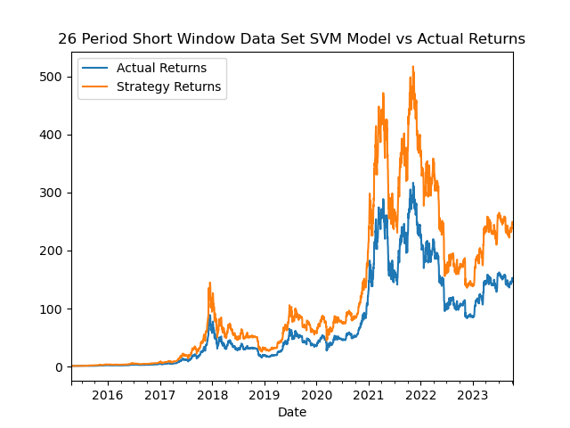

# Machine Learning Trading Algorithm with BTC/AUD

This README has been created to define our project scope and overview of the Machine Learningproject. Exploring the problem, questions, datasources and goals. 

## Table of Contents
- [Introduction](#introduction)
- [Installation](#installation)
- [Usage](#usage)
- [Data Collection](#data-collection)
- [Data Analysis](#data-analysis)
- [Projections](#projections)
- [Contributing](#contributing)
- [License](#license)

 ___ 
# Introduction

Our Machine Learning Algorithm Project has been created to assess the performance of various trading algorithms against the historic cumulative returns of Bitcoin against the Australian Dollar. We utilise data from yfinance to create a standard dataframe of historic BTC prices to benchmark each algorithms performance. During this project we identify the model with the greatest returns against historic cumulative returns between January 2018 and October 2023. With this assessment a model with the greatest returns will be determined. The training and evaluation of models will be assessed. 

___
# Installation
This guideline is provided to support installation of new packages and/or files required to utilise the Project 2 models. 
### Installation - TA-Lib (Technical Analaysis Library)
##### Requirements
* Requires Homebrew (MAC)
* Requires Python and Pip (Windows)

#### Install (MAC OS)
 * Open a new terminal window
 * Use Homebrew to install TA-Lib:

```shell 
 brew install ta-lib
```

* Verify installation

```shell
ta-lib-config --libs
```

#### Install (Windows)
* Download TA-Lib's binary (32-bit or 64-bit) for Windows from the official website: https://www.lfd.uci.edu/~gohlke/pythonlibs/#ta-lib
* Choose the version compatible with your Python installation (e.g., cp39 for Python 3.9).
* Download the file with a .whl extension, e.g., TA_Lib‑0.4.0‑cp39‑cp39‑win_amd64.whl.
* Open your terminal or command prompt.

* Navigate to the directory where you downloaded the .whl file.

* Install TA-Lib using pip. Replace the file name with the one you downloaded:

```shell
pip install TA_Lib-0.4.0-cp39-cp39-win_amd64.whl
```
* Verify the installation by running:

```shell
python -c "import talib; print(talib.__version__)"
```

___
# Usage

1. Complete the Installation instructions above for your Operating System.
2. Open notebook/
3. Run the notebook

### Create four machine learning trading algorithm's using BTC csv data to generate returns try and outperform the cumulative daily returns. 
  Support Vector Classifier - Duke  
  
  Neural Network - Anna  
  
  Regression - Hardy  
  
Finish with plot comparing BTC daily returns vs trading strategy returns similar to what we did in Algorithmic Trading Module homework. 
Example:  


Technical Requirements:  

*  Create a Jupyter Notebook, Google Colab Notebook, or Amazon SageMaker Notebook to prepare a training and testing dataset.
* Optionally, apply a dimensionality reduction technique to reduce the input features, or perform feature engineering to generate new features to train the model.
* Create one or more machine learning models.
* Fit the model(s) to the training data.
* Evaluate the trained model(s) using testing data. Include any calculations, metrics, or visualizations needed to evaluate the performance.
* Show the predictions using a sample of new data. Compare the predictions if more than one model is used.
* Save PNG images of your visualizations to distribute to the class and instructional team and for inclusion in your presentation and your repo's README.md file.
* Use one new machine learning library, machine learning model, or evaluation metric that hasn't been covered in class.
* Create a README.md in your repo with a write-up summarizing your project. Be sure to include any usage instructions to set up and use the model.

